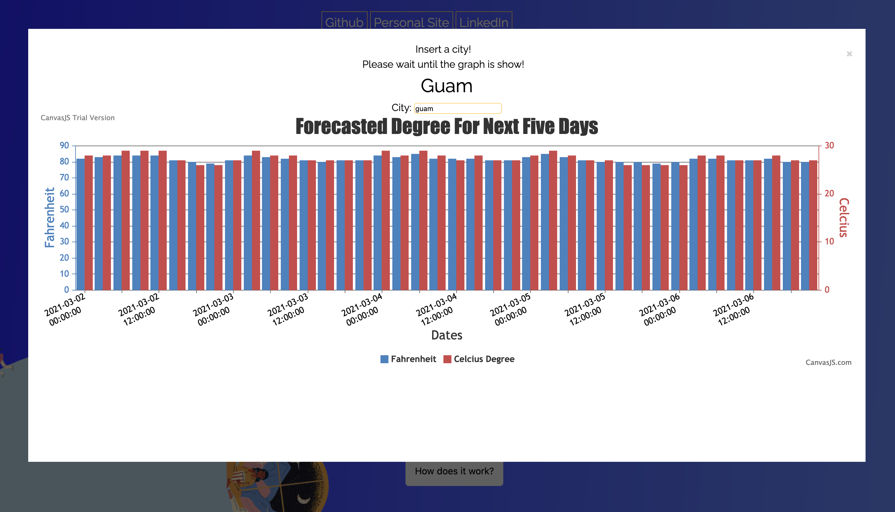

# Zone

[Click here to view the live site!](https://janebaik.github.io/zone/)

## Overview

## Zone was built with: 
* JavaScript
* HTML
* CSS
* SASS

## Cool Features 

### Diagram
* This diagram gives you the forecast of the weather for the upcoming days! You can search all over the world and the diagram will be updated with the new information. 

### Continuous scrolling effect	
* As the user scrolls, information on the website is updated with the upcoming forecast and the background will change from morning to night. 

### Music
* The music is linked with the current weather condition! The goal of this fun feature is to let users have a calming audio experience of the weather. 
Telling users their weather degree, cloud condition

