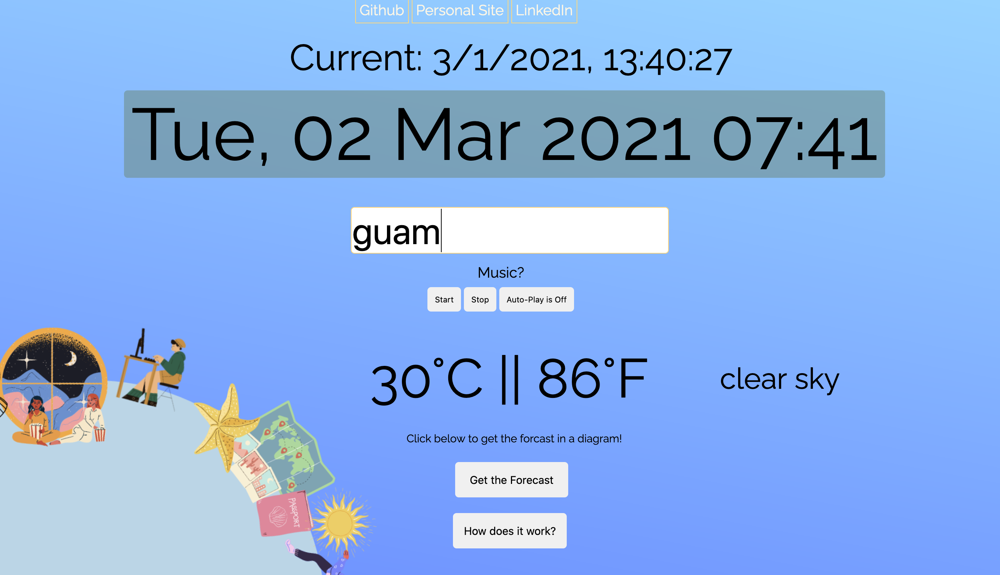

# Zone

[Click here to view the live site!](https://janebaik.github.io/zone/)

## Overview

## Zone was built with: 
* JavaScript
* HTML
* CSS
* SASS

## Features 
Telling users their weather degree, cloud condition	

Diagram

search for different timezones and different weather conditions

Continuous scrolling effect	
search for different timezones and different weather conditions	
Music
